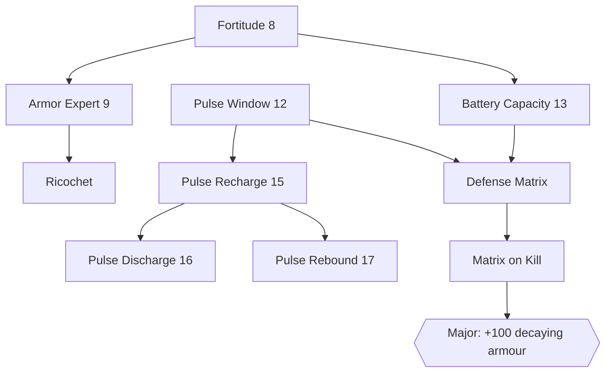
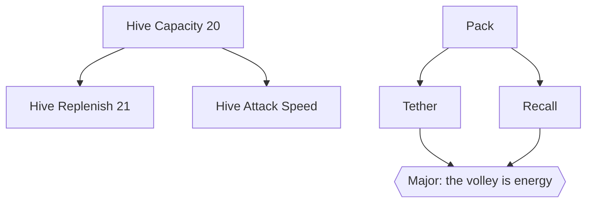
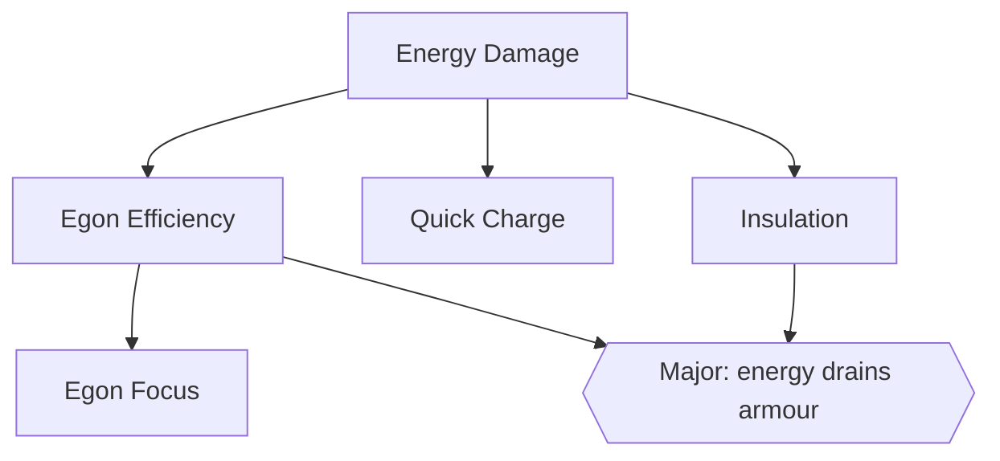
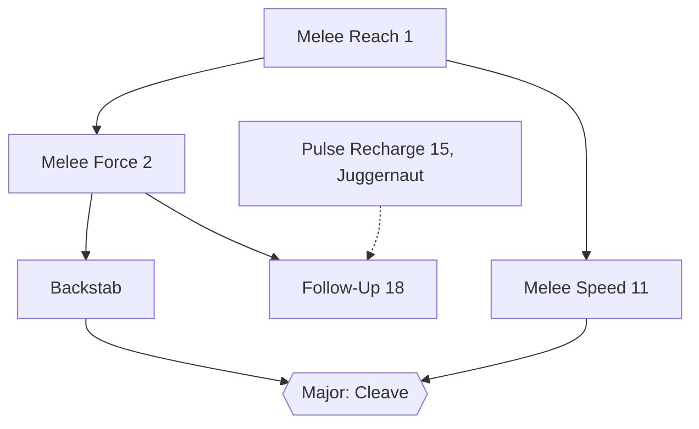
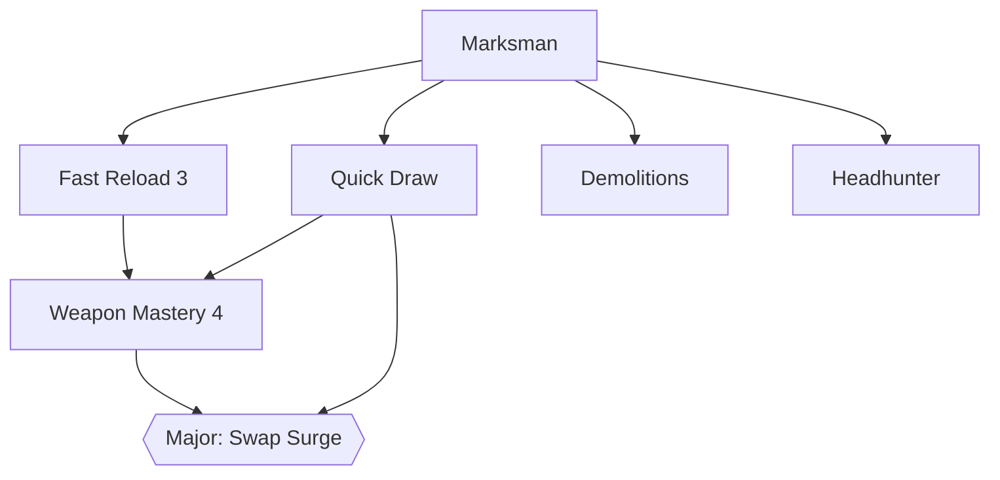
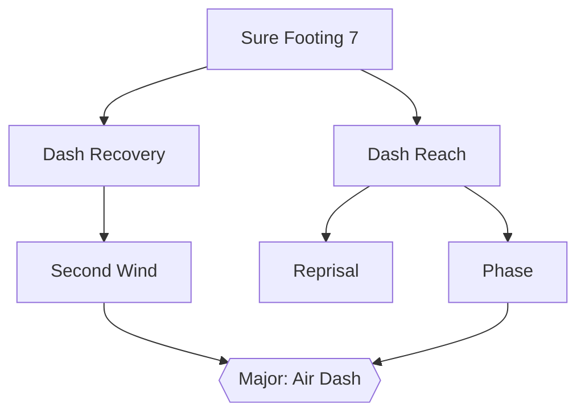
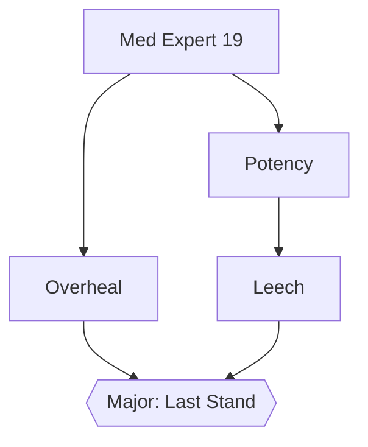
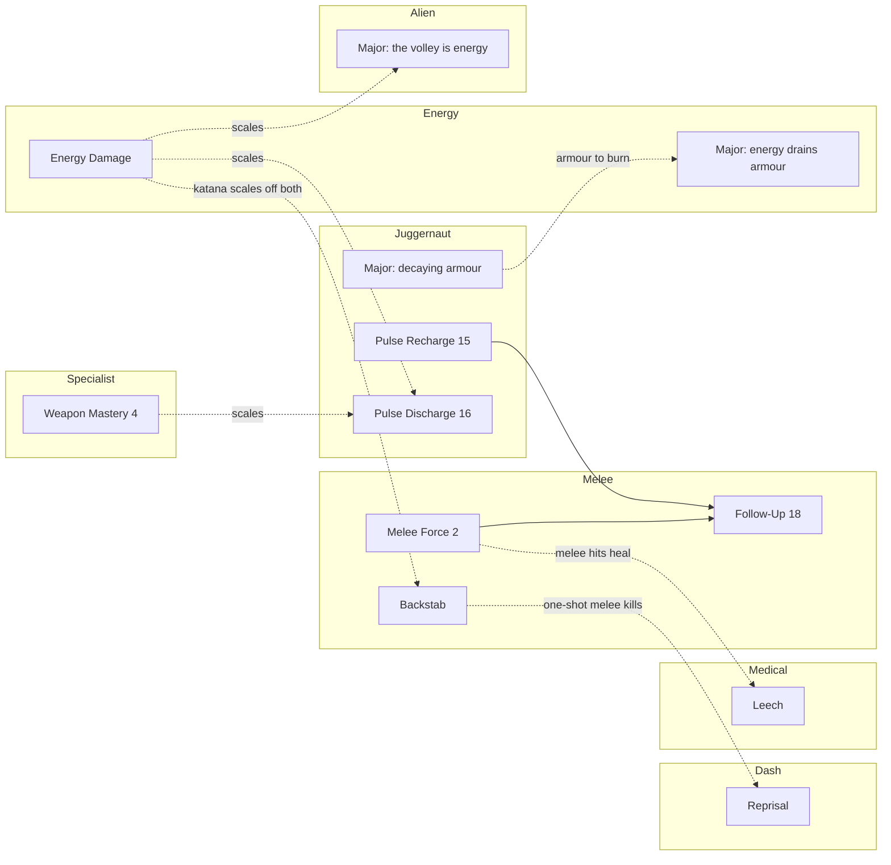

# The Skill Tree — the agreed design

The tree as settled on 2026-09-13, in seven grilling sessions, as a single reference. The reasoning, the
rejected shapes and what each node costs to build are in [ROADMAP.md, Pillar 4: Routes](ROADMAP.md#pillar-4-routes);
this document is the shape only. What exists in code today is in [PILLARS.md pillar 4](PILLARS.md#4-skill-trees).

**How to read it.** A **Route** is a build path: a set of Skills whose bonuses multiply into one way of
playing ([CONTEXT.md](../CONTEXT.md) vocabulary, proposed in ROADMAP.md). A Route crosses columns; the
seven Routes are not seven columns. An arrow in a diagram means "you need this" and nothing else: the tree
is AND-only, a node with two arrows into it needs both, and there are no OR gates and no lockouts.

**What is settled and what is a first cut.** Every Route's **root**, **major node**, node list and
effects are settled, and so is every **cross-Route link**. The prerequisite chains *in the middle* of each
Route were never put as a question and are a first cut here, to be corrected when the Route is built.
Costs are not set: the pricing pass has its own open question, at the end. New nodes have no ids yet; ids
are assigned when a node is built, never reused, and **22 and 23 are spoken for** by a stealth column.

## Principles the tree is curated under

- **More Skills, no dilution.** Nodes are multipliers that stack into builds, not flat numbers that each
  add a little.
- **Nothing rewards standing still.** Both regenerations were cut; every node acts on an action.
- **The normal movement rules stay.** No node changes ground speed or jump height. Reaching high places is
  a Module's job.
- **No new binds where a weapon or an existing key will do.**
- **Stacking is the goal.** The acceptance example is a Gargantua killed by one katana Backstab, which is
  Melee × Energy.

## Summary

| Route | Nodes | Root | Major node | Needs |
| --- | --- | --- | --- | --- |
| [Juggernaut](#juggernaut) | 11 | Fortitude (8) | +100 decaying armour on Matrix activation | The Pulse Module for its Pulse nodes |
| [Alien](#alien) | 7 | Hive Capacity (20) | The volley is energy damage | The alien Module; the whole Route is hidden until it |
| [Energy](#energy) | 6 | Energy Damage | Energy attacks drain armour for bonus damage | — |
| [Melee](#melee) | 6 | Melee Reach (1) | Cleave | — |
| [Weapon Specialist](#weapon-specialist) | 7 | Marksman | Swap Surge | — |
| [The Dash Route](#the-dash-route) | 7 | Sure Footing (7) | Air Dash | The Dash Module for its Dash nodes |
| [Medical](#medical) | 5 | Med Expert (19) | Last Stand | — |

49 nodes, ranks counted once. About sixteen carry ranks.

---

## Juggernaut

**Low mobility, high defense**, and the whole of the Pulse: the timing branch that exists, the Defense
Matrix, and the armour both lean on. [ROADMAP](ROADMAP.md#juggernaut--resilient).

| Node | Id | Effect | Ranks | State |
| --- | --- | --- | --- | --- |
| Fortitude | 8 | +25 max health | — | Exists. **Root** |
| Armor Expert | 9 | Less of each hit gets past armour | 1→2→3 | Exists |
| Battery Capacity | 13 | More max armour | 1→2 | Exists |
| Ricochet | new | A chance per bullet to bounce it, negated for the player, dealt to the attacker. Bullets only, needs armour | ranks | New |
| Pulse Window | 12 | The Shield stands longer | — | Exists |
| Pulse Recharge | 15 | The Recharge is shorter | — | Exists |
| Pulse Discharge | 16 | Negated hits vent at the crosshair, as energy | — | Exists |
| Pulse Rebound | 17 | A deflect skips the Recharge, once per charge | — | Exists |
| Defense Matrix | new | Hold the Pulse key 1 s: armour takes a far larger share of every hit, the player is slowed 20%, drops on release / 6 s / zero armour, 10 s cooldown. Armour is the pool; nothing refills by waiting | — | New. Gate |
| Matrix on Kill | new | A kill while the Matrix is up restores some armour | — | New |
| **Major** | new | **+100 decaying armour on Matrix activation** (numbers to be toned down). The Energy tie | — | New |

The Matrix is gated on both strands on purpose: it is the press *and* the armour. Every Pulse node,
including the Matrix, is hidden until the player holds the Pulse Module.

---

## Alien

Built on the **alien Module**: a platform for Core-powered alien weapons, handed over whole by the freed
alien slave, whose first weapon summons ghost slaves. **The whole Route is hidden until the Module is
gained**, Hive nodes included. [ROADMAP](ROADMAP.md#alien).

| Node | Id | Effect | Ranks | State |
| --- | --- | --- | --- | --- |
| Hive Capacity | 20 | Hivehand holds more hornets | — | Reserved. **Root** |
| Hive Replenish | 21 | Hornets replenish faster | — | Reserved as `HiveRegrowth`; display name changes |
| Hive Attack Speed | new | Hivehand fires faster (predicted; both DLLs) | — | New |
| Pack | new | Maximum ghosts out | 1→2→3 | New |
| Tether | new | Ghost lifetime longer | — | New |
| Recall | new | Summon cooldown shorter | — | New |
| **Major** | new | **The volley is energy damage**: scales with the Energy Route and passes the Gargantua filter. Expected to change | — | New |

Dropped: Poise (a longer hold window) and a Snark node; Snarks may leave the mod.

---

## Energy

**Energy is `DMG_ENERGYBEAM` and nothing else.** The energy weapons are the katana and the egon; the gauss
is probably removed. The katana always deals energy damage, slash and wave, and scales off both Melee and
Energy. [ROADMAP](ROADMAP.md#energy).

| Node | Id | Effect | Ranks | State |
| --- | --- | --- | --- | --- |
| Energy Damage | new | Energy damage dealt up. The katana, the egon, the Discharge and the Alien volley all read it | 1→2→3 | New. **Root** |
| Egon Efficiency | new | Uranium drains slower; also cheapens the katana's charged wave | ranks | New |
| Egon Focus | new | Secondary fire unlocks the egon's narrow beam (dormant in the SDK) | — | New. Details to be decided |
| Quick Charge | new | The katana's charged wave charges faster | — | New. First to cut |
| Insulation | new | Less energy **and shock** damage taken | — | New |
| **Major** | new | **Energy attacks drain armour as well, for bonus damage. Always on, never below a floor** (~20) | — | New |

The major node serves two builds: the Juggernaut, with a deep armour bar and the Matrix's grant to burn,
and the glass-cannon "ninja", who dashes and slashes with the katana.

---

## Melee

A **roster on the crowbar's base**: crowbar all-round, katana the ultimate, pickaxe slower and stronger,
knife with a higher Backstab base, maybe more. Valve's rapid-swing halving is dropped: every swing does
full damage. [ROADMAP](ROADMAP.md#melee).

| Node | Id | Effect | Ranks | State |
| --- | --- | --- | --- | --- |
| Melee Reach | 1 | Swings connect from further | — | Exists as Crowbar Reach. **Root** |
| Melee Force | 2 | Hits land harder | ranks | Exists as Crowbar Force |
| Melee Speed | 11 | Swings come faster | — | Reserved; returns |
| Backstab | new | The rear-arc multiplier: 3× base, ranks raise it to ~5×. Multiplies each weapon's own Backstab base | ranks | New |
| Follow-Up | 18 | After a deflect, the next hit lands far harder | — | Exists. **Cross-Route link** |
| **Major** | new | **Cleave**: the first hit after an internal cooldown hits everything in its arc and lands harder | — | New |

The never-noticed Backstab tier (a larger multiplier when the victim never acquired the player) is a
**Stealth** node, not a Melee one.

---

## Weapon Specialist

Handling speed, typed damage, and a major node that makes swapping weapons the way to fight. Numbers are
Skills; identity (a silencer, a second barrel) is an Evolution. [ROADMAP](ROADMAP.md#weapon-specialist).

| Node | Id | Effect | Ranks | State |
| --- | --- | --- | --- | --- |
| Marksman | new | Bullet damage up | ranks | New. **Root** |
| Fast Reload | 3 | Reloads quicker; rank one covers the shotgun | ranks | Exists |
| Quick Draw | new | Weapons come up faster (predicted; both DLLs) | ranks | New |
| Weapon Mastery | 4 | All weapons +10% | — | Exists. Moved deeper |
| Demolitions | new | Explosive damage dealt up, explosive damage taken down (own grenades included) | ranks | New |
| Headhunter | new | Headshot damage up. Designed with Decapitation | ranks | New |
| **Major** | new | **Swap Surge**: for 1–2 s after a weapon swap, everything the weapon deals lands harder; internal cooldown | — | New. Name provisional |

Cut: Bandolier (ammo carry ceilings). The per-tier reload and draw animations are ART_DEBT work the nodes
create, not a promise they make.

---

## The Dash Route

Name pending; *Ninja* is the candidate. Built on the **Dash Module**: a tap of shift, a burst in the
direction of movement, ground only until the major node; charges and a cooldown; walk is rebound.
[ROADMAP](ROADMAP.md#the-dash-route-name-pending).

| Node | Id | Effect | Ranks | State |
| --- | --- | --- | --- | --- |
| Sure Footing | 7 | Falls deal half damage | — | Exists. **Root** |
| Dash Reach | new | The Dash goes further | ranks | New |
| Dash Recovery | new | The Dash comes back sooner | ranks | New |
| Second Wind | new | A second Dash charge | — | New |
| Reprisal | new | A one-shot melee kill (a single hit that kills an unhurt monster) refills a Dash | — | New. Name provisional |
| Phase | new | No damage taken during the Dash itself | — | New. First to cut if too strong |
| **Major** | new | **Air Dash**: the Dash works in the air, and in the air goes where the player aims, upward included | — | New |

Every Dash node is hidden until the player holds the Dash Module; Sure Footing is always shown. No bullet
time: dropped.

---

## Medical

The smallest Route, with **no passive healing in it at all**. [ROADMAP](ROADMAP.md#medical).

| Node | Id | Effect | Ranks | State |
| --- | --- | --- | --- | --- |
| Med Expert | 19 | An Infusion runs longer | — | Exists. **Root** |
| Potency | new | An Infusion heals more per second, and a medkit heals more | ranks | New. Name provisional |
| Overheal | new | A Syringe at full health raises health above the maximum for the Infusion's length, decaying back | — | New |
| Leech | new | Melee hits heal a fraction of the damage dealt. The chainsaw's lifesteal is its own base property | — | New |
| **Major** | new | **Last Stand**: a hit that would kill the player spends an unused Syringe automatically and starts the Infusion; all Infusion healing is doubled below 50 health | — | New |

Last Stand fires only when no Infusion is running ([ADR-0007](adr/0007-the-infusion-is-one-at-a-time.md)).

---

## Cross-Route links

The builds live here. Solid links are prerequisites in the tree; dotted ones are effects that read another
Route's nodes.

| Link | What it is |
| --- | --- |
| **Follow-Up (18)** needs Melee Force *and* Pulse Recharge | The one cross-Route prerequisite in the tree today: a crowbar payoff for a Pulse deflect |
| **The katana scales off Melee and Energy** | The Gargantua build. Backstab ranks × Energy Damage ranks on a blade that is always energy |
| **Juggernaut major → Energy major** | Raise the Matrix, gain decaying armour, fire the egon into it. Armour as fuel |
| **Energy Damage scales the Discharge and the Alien volley** | Both are energy; neither Route sells damage of its own |
| **Weapon Mastery scales the Discharge** | Emergent since the Discharge exists; kept |
| **Reprisal reads melee kills** | A one-shot melee kill refills a Dash; the Backstab and Cleave are how you get one |
| **Leech reads melee hits** | Medical × Melee: the sustain the glass cannon lacks |
| **The never-noticed Backstab tier** | A Stealth node on Melee's mechanic; ids 22–23 |

## Reveal gates

A node is hidden until the player holds the thing it modifies. Settled per Route, not per node.

| Hidden until | Nodes |
| --- | --- |
| The Pulse Module | Pulse Window, Recharge, Discharge, Rebound, the Defense Matrix and everything behind it |
| The alien Module | The whole Alien Route, Hive nodes included |
| The Dash Module | Every Dash node; Sure Footing stays visible |

## Cut and reserved

| Skill | Id | State | Why |
| --- | --- | --- | --- |
| Battery Regen | 14 | **Cut** | Overpowered, rewards idling |
| Regeneration | 10 | **Cut** | Same shape; passive, rewards standing still |
| High Jump | 5 | **Cut** | Alters the normal movement rules; reaching is a Module's job |
| Sprint Speed | 6 | **Cut** | Alters the normal movement rules |
| Crowbar Speed | 11 | Returns as Melee Speed | The halving rule that blocked it is dropped |
| Hive Capacity, Hive Regrowth | 20, 21 | Return in the Alien Route | Reserved today |
| Stealth column | 22, 23 | Spoken for, not yet in the enum | The never-noticed Backstab tier is its first node |

Cut ids stay reserved forever and are never reused.

## The economy, unresolved

The seven Routes sum to 49 nodes with ranks counted once, against 16 today, and about sixteen carry two
or three ranks. At today's prices that is roughly 100 points before ranks, against a **50–70 target**. One
of three things moves: prices come down, the target becomes what the critical path affords rather than the
tree's total, or the tree is deliberately not completable. Not decided; to be answered against a map. See
[ROADMAP.md](ROADMAP.md#infrastructure-notes-from-the-same-session).

## What is built first

Not decided. Melee and Weapon Specialist need the least new machinery; the Juggernaut needs a
press-and-release Pulse command pair; the Dash and Alien Routes each need their Module. Before any of
them: the id-space ceiling and the fitted icon draw, both in the ROADMAP infrastructure notes.
