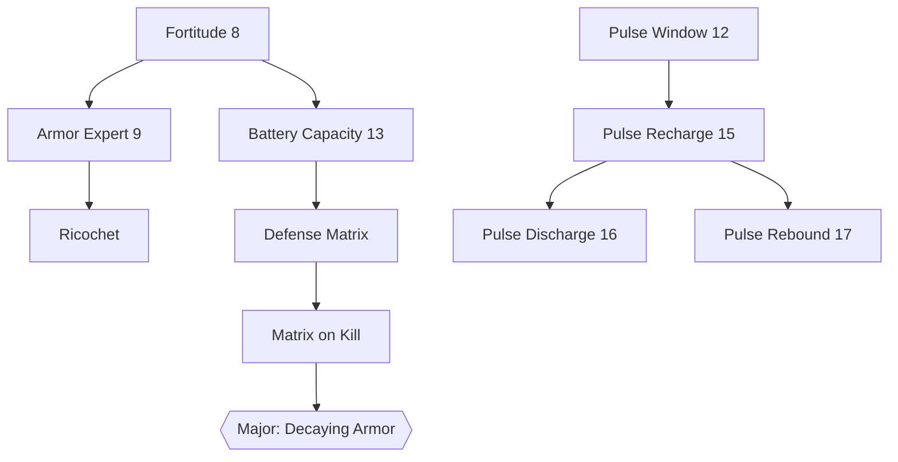
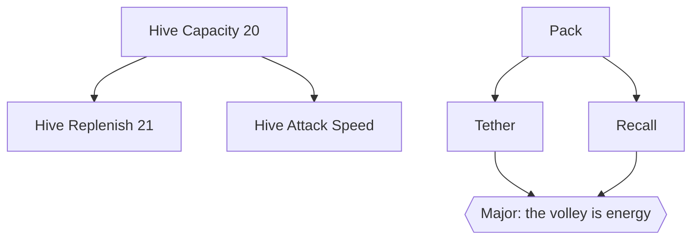
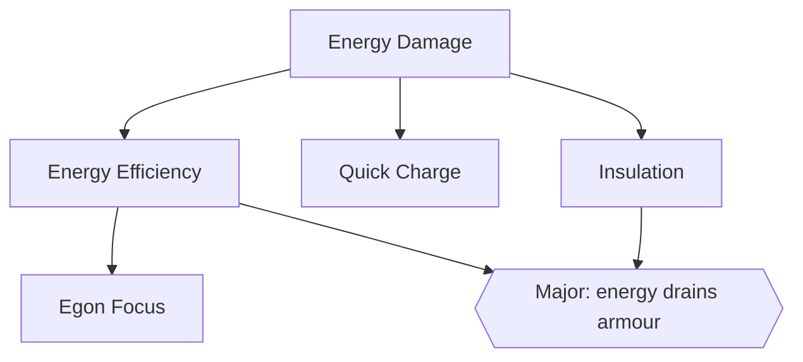
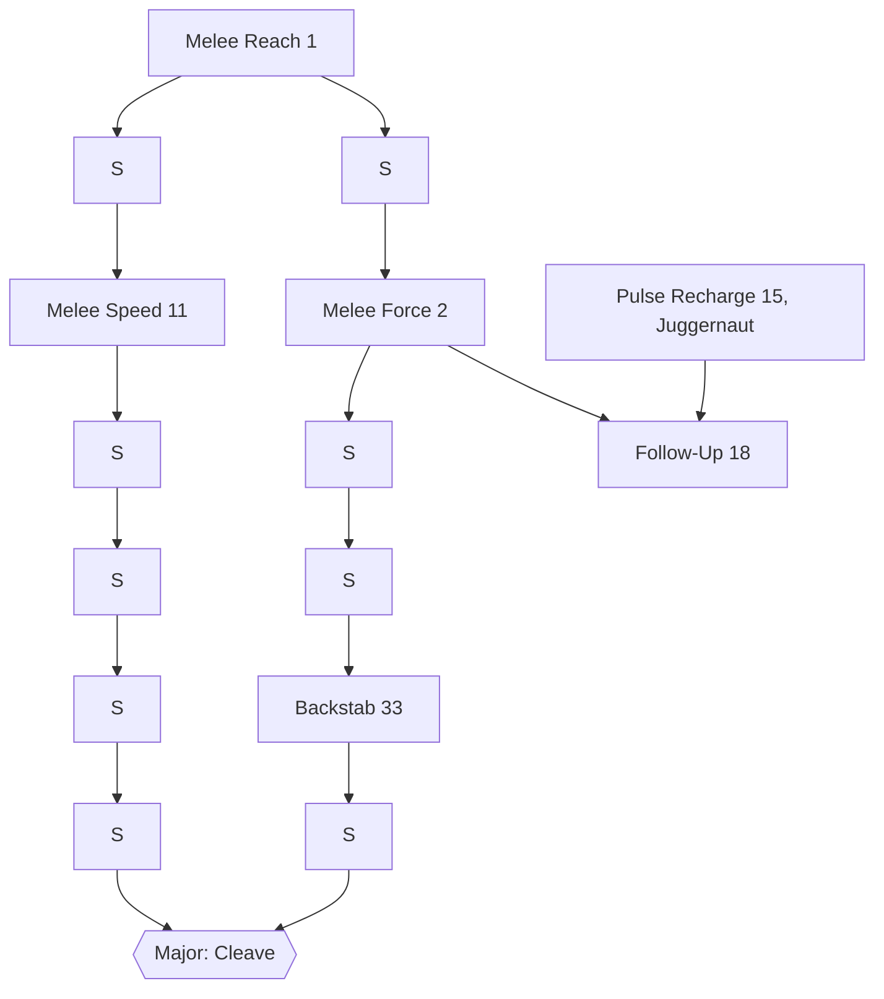
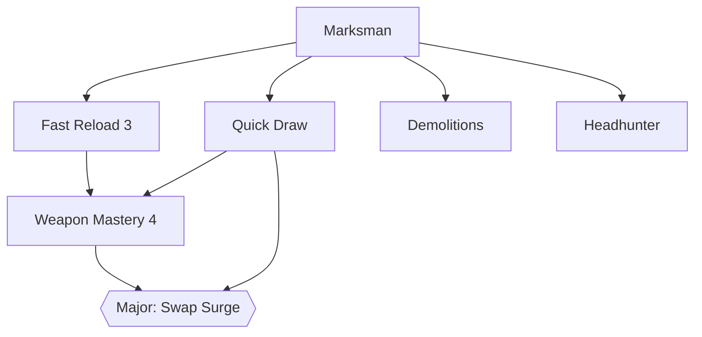
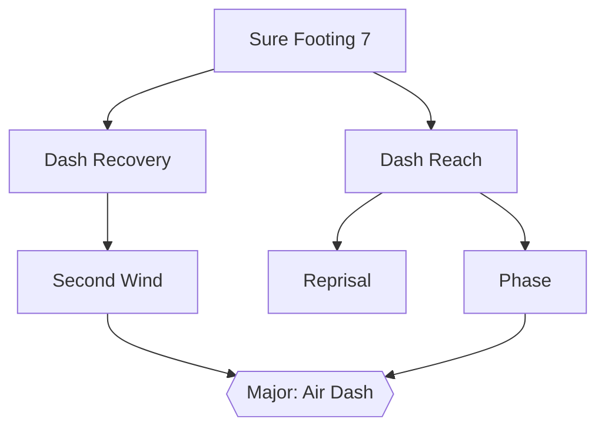
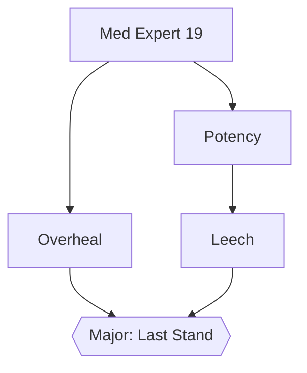
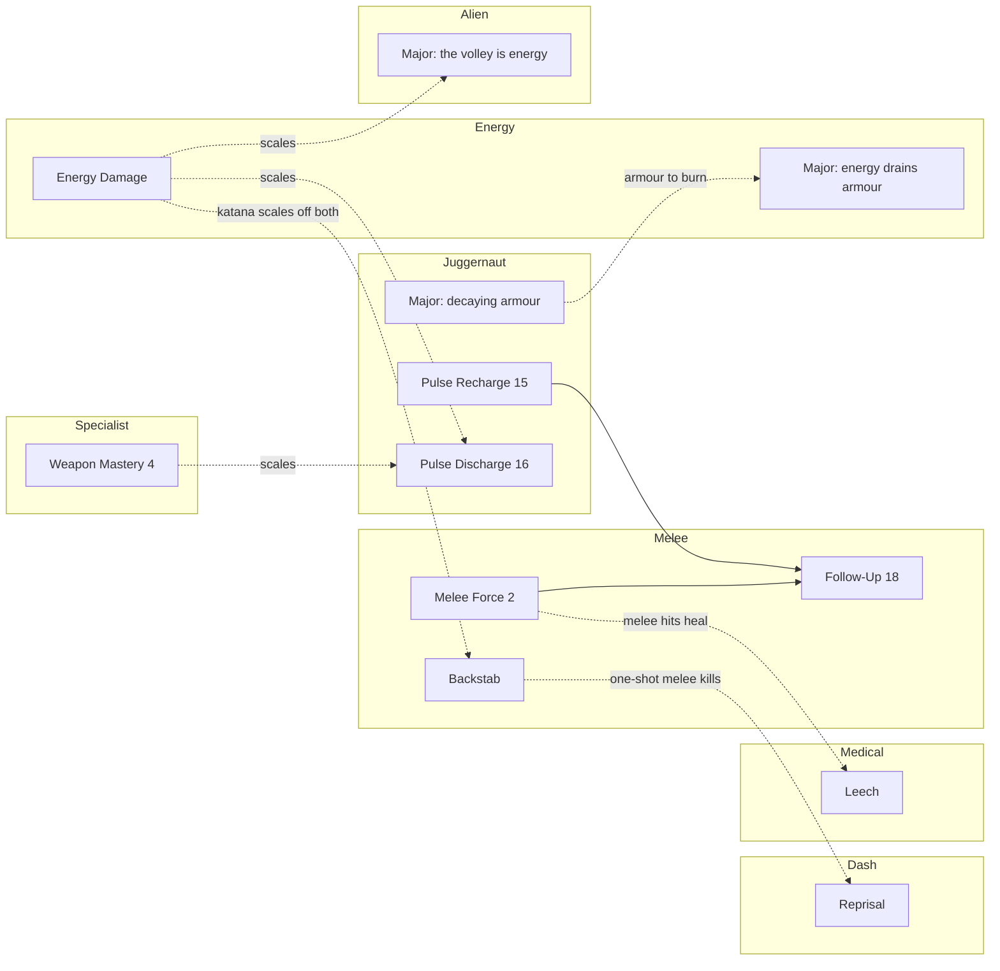

# The Skill Tree — the agreed design

The tree as settled on 2026-09-13, in seven grilling sessions, as a single reference. The reasoning, the
rejected shapes and what each node costs to build are in [ROADMAP.md, Pillar 4: Routes](ROADMAP.md#pillar-4-routes);
this document is the shape only. What exists in code today is in [PILLARS.md pillar 4](PILLARS.md#4-skill-trees).

**How to read it.** A **Route** is a build path: a set of Skills whose bonuses multiply into one way of
playing ([CONTEXT.md](../CONTEXT.md) vocabulary, proposed in ROADMAP.md). A Route is a region of the
tree; the seven Routes are not seven columns. An arrow in a diagram means "you need this" and nothing
else — **and since 2026-09-15 there are no arrows in the tree at all**: every node opens from any owned
orthogonal neighbour, and empty cells are the only walls ([one start, open roads](#one-start-open-roads--settled-2026-09-15)).
The per-Route diagrams below are kept as the record of each Route's intended order, which the region map
reproduces with distance and empty cells rather than gates; the region map is authoritative where they
disagree.

**What is settled and what is a first cut.** Every Route's **root**, **major node**, node list and
effects are settled, and so is every **cross-Route link**. The prerequisite chains *in the middle* of each
Route were never put as a question and are a first cut here, to be corrected when the Route is built.
Costs are not set: the pricing pass has its own open question, at the end. New nodes have no ids yet; ids
are assigned when a node is built, never reused, and **22 and 23 are spoken for** by a stealth column.

## Principles the tree is curated under

- **More Skills, no dilution.** Nodes are multipliers that stack into builds, not flat numbers that each
  add a little. **Amended 2026-09-14:** flat numbers are allowed as *roads*, never as destinations — see
  [the matrix](#the-matrix--settled-2026-09-14). A player who paths somewhere *for* a Stat node is the
  dilution this principle warned about; the Stat nodes exist to be walked through on the way to a Skill.
- **Every node costs one Skill Point.** Price is distance: a strong Skill is expensive because of the
  Stat nodes on the road to it, not because of a number on it. Nothing is printed on a node. **Amended
  2026-09-15:** distance is measured from what the player already owns, not from a root, so the same
  Skill is cheap for one build and dear for another.
- **One start, and roads are open.** The suit at the centre is held from the first moment; every node
  opens from any owned orthogonal neighbour; empty cells are the walls. The player chooses *how* to
  reach a Skill, not only whether ([ADR-0012](adr/0012-the-skill-tree-has-one-start-and-open-roads.md)).
- **Nothing rewards standing still.** Both regenerations were cut; every node acts on an action.
- **The normal movement rules stay.** No node changes ground speed or jump height. Reaching high places is
  a Module's job.
- **No new binds where a weapon or an existing key will do.**
- **Stacking is the goal.** The acceptance example is a Gargantua killed by one katana Backstab, which is
  Melee × Energy.

## Summary

| Route | Nodes | Root | Major node | Needs |
| --- | --- | --- | --- | --- |
| [Juggernaut](#juggernaut) | 11 | Fortitude (8) | +100 decaying armour on Matrix activation | The Pulse Module for its Pulse nodes. **Built whole 2026-09-16**: the Matrix trio has its effects, on a `+pulse` hold |
| [Alien](#alien) | 7 | Hive Capacity (20) | The volley is energy damage | The alien Module; the whole Route is hidden until it. **Placed hidden 2026-09-15; the Module, Cores, the Hive nodes and the summon's left click built 2026-09-16**, untested in game — Pack, Tether, Recall and the Major still to come |
| [Energy](#energy) | 6 + 4 Stat | Energy Damage (54) | Overdraw: energy attacks drain armour for bonus damage | — . **Building since 2026-09-14** |
| [Melee](#melee) | 6 + 9 Stat | Melee Reach (1) | Cleave | — . **Built 2026-09-14** |
| [Weapon Specialist](#weapon-specialist) | 7 + 7 Stat | Marksman (35) | Swap Surge (39) | — . **Built 2026-09-14** |
| [Shinobi](#shinobi--the-dash-route) | 7 | Sure Footing (7), in the hub since 2026-09-15 | Air Dash | The Dash Module for its Dash nodes. **Placed hidden 2026-09-15**, no effects yet |
| [Medical](#medical) | 5 + 4 Stat | Med Expert (19) | Last Stand | — . **Building since 2026-09-14** |
| [Stealth](#stealth) | 7 | Soft Step | Silent Kill | The Night Vision Module; the region is hidden until it. **Shaped and placed hidden 2026-09-15; every node short of the post-aggro step, and the Module, built 2026-09-16**, untested in game |

49 Skills, ranks counted once. About sixteen carry ranks, and each rank becomes a Stat node on the road
under [the matrix](#the-matrix--settled-2026-09-14); the tree that results is **154 nodes** (153 buyable)
on the 15×15 board settled cell by cell on 2026-09-15 in [SKILL_MAP.md](SKILL_MAP.md), against **100
findable Skill Points**. The "Root" column above names
each Route's entry Skill, the first Skill on the way in from the hub; since 2026-09-15 none of them is a
root in the old sense, because the tree has one start.

---

## The matrix — settled 2026-09-14

The tree gains a fourth and smallest kind of node, the **Stat node**, and with it becomes a dense grid
that has to be pathed through efficiently. Decided in conversation on 2026-09-14, after the fitted node
draw showed the panel could hold well over a hundred nodes.

- **A Stat node grants one flat bonus and nothing else** — +5% melee damage, +5% max health, +5% energy
  damage. It is the smallest tier, below Minor, and it shares its icon with every other Stat node of the
  same stat, so a road reads as what it is made of.
- **Stat nodes are the cost of Skills.** A Skill is reached by taking the Stat nodes on the road to it.
  That is where the price lives, so **every node in the tree costs exactly one Skill Point** and the cost is
  no longer drawn on the node or anywhere else. The open question about where the cost display goes is
  closed: nowhere.
- ~~**Reachability does not change.** A node opens when its prerequisites are held — two at most, both
  required — and the prerequisites are curated, edge by edge, as they are today. The matrix is not free
  pathing between neighbours; it is a directed tree whose roads happen to be dense.~~ **Superseded
  2026-09-15** by [one start, open roads](#one-start-open-roads--settled-2026-09-15): every node opens
  from any owned neighbour, no gates remain, and a Major that wants a long road gets it from empty cells.
- ~~**Roots stay where they are.** Each Route's root is always available and a player starts wherever they
  like, as today.~~ **Superseded 2026-09-15**: the suit at the centre is the only start.
- **Stat types are themed by Route**, about eight in all, so the road through a Route's region is made of
  that Route's stat. Crossing into another Route's region means taking nodes of *its* stat, which is the
  trade that makes efficient pathing mean something.
- **Routes connect through curated roads.** Melee's region reaches Energy's through Stat nodes placed for
  the purpose, so the Gargantua build is a literal path on the tree. Which regions connect, and where, is
  curation, not adjacency.
- **The tree is deliberately not completable.** ~~Fifty to seventy Skill Points against 120–180 nodes buys a
  third to a half of the tree.~~ **Renumbered 2026-09-15**: 100 findable points against about 140 nodes,
  so a thorough player owns about 71% of it and a critical-path player about 29%; see [the economy](#the-economy--resolved-2026-09-14).
  It reverses the stance PILLARS pillar 4 recorded ("completable only by near-exhaustive exploration").
  Reset Tokens matter more for it, not less.
- **Ranks are gone as a drawing case.** "Energy Damage 1→2→3" is three energy Stat nodes on the road to the
  Energy major. The chained-ids-drawn-as-one idea in the ROADMAP infrastructure notes is withdrawn.

What it costs to build, before the first Stat node exists:

- ~~**The id ceiling** (96) is a save-format constant and has to be raised once, to 256.~~ **Built
  2026-09-14**, with the saved field renamed so a 96-entry save resets rather than over-reads.
- ~~**A fourth `ENodeTier`**, below Minor, and a grid step that follows the Stat node.~~ **Built
  2026-09-14**: `ENodeTier::Stat`, square nodes of 32 / 44 / 54 / 64 on a 96-pixel step, both axes.
- ~~**A layout check.**~~ **Built 2026-09-14, both halves.** 180 hand-placed rows in `skill_defs.h` is
  where mistakes will live: two nodes in one cell, an edge to a node that is not adjacent. A
  `static_assert` catches the first (`SkillDefsOnePerCell`); the client cvar `skilltree_debug_edges`
  catches the second, drawing any prerequisite edge whose ends are not neighbours (diagonals count) thick
  and red with its span at the midpoint, and listing them to the console once.

---

## One start, open roads — settled 2026-09-15

The grill that preceded the third Route, held before any further node was built. Four things were put as
questions with a recommendation each, and the answers below are Andrei's. The reasoning for the first is
[ADR-0012](adr/0012-the-skill-tree-has-one-start-and-open-roads.md).

### The rule

- **The suit is the start.** One node at the centre of the tree, held from the first moment of a game and
  kept through a Reset. It is the only node that is not bought. There are no other roots.
- **Every node opens from any owned orthogonal neighbour.** Stat node, Skill, Major, keystone alike.
  There are no curated prerequisites left anywhere and no AND gates; the two prerequisite columns leave
  the table. Diagonals do not count. *(Settled later the same day, after a first cut kept curated gates
  on Skills: one rule, no exceptions.)*
- **Empty cells are the walls.** Pathing is limited by where nothing is placed, not by gates. A Major is
  dear because the empty cells around it force a long road, so the region map is the whole of the pricing.
- **A Reset clears everything but the suit.**
- **Hidden means impassable.** A node behind a reveal gate is drawn as a blank pad and cannot be bought,
  so a gated region is a wall until its Module is found and nobody buys blind. Two placement rules
  follow: every seam node sits on the ungated side (Glass Cannon is in Melee's cells, not Shinobi's), and
  the Juggernaut's Pulse nodes sit on the far side of its region so its Max Armour roads stay open before
  the Pulse Module.

### The regions

A 15×15 grid, nine regions of 5×5. The centre is the **hub**; the four **edge** regions touch it and hold
the Routes a player can use in the first hour; the four **corner** regions touch no part of the hub and
hold the Routes gated on a Module or a late weapon, reached only through their two edge neighbours. A
**seam** is the shared border of two rim regions, and it is where cross-Route builds pay their toll in the
neighbour's stat.

```
        cols 0-4          cols 5-9           cols 10-14
rows    DASH              MEDICAL            STEALTH
0-4     corner            edge               corner
        (Dash Module)                        (a Stealth Module, perhaps)

rows    MELEE             HUB                WEAPON SPECIALIST
5-9     edge              the suit at (7,7)  edge

rows    ENERGY            JUGGERNAUT         ALIEN
10-14   corner            edge               corner
        (katana, egon)    (Pulse Module      (alien Module)
                           for its Pulse nodes)
```

Why this ring and not another:

- **Melee's two corner neighbours are Energy and Dash.** Melee has more cross-links than any Route
  (Energy, Juggernaut, Dash, Medical, Stealth) and an edge region touches only two corners. Energy is the
  Gargantua build and Dash is the ninja; they won. Juggernaut, Melee's third strong link, is reached
  through the hub's corner cell, where Follow-Up already needs both.
- **Stealth is a corner, opposite Melee**, on purpose: it is gated behind the Night Vision Module (settled
  later the same day), and the corners are where gated Routes live. The cost is that Dash and Stealth do not touch — both are
  corners — so the ninja's stealth half is reached through Medical's region or the hub, and the
  never-noticed Backstab tier is far from the Melee region. Recorded as a known trade, not an oversight.
- **Medical is the edge between Dash and Stealth.** It is ungated, so it belongs on an edge, and Leech
  reaches Melee through the hub.

The seams, clockwise from the top-left: Dash–Melee (the ninja's, and the keystone's), Dash–Medical,
Medical–Stealth, Stealth–Specialist, Specialist–Alien, Alien–Juggernaut, Juggernaut–Energy (armour as
fuel), Energy–Melee (the Gargantua build).

### The hub

The 5×5 centre. The suit sits at (7,7). **Settled 2026-09-15, second round:** the hub's Stat nodes are
**four stats, each facing the edge Route it belongs to** — +5% max health toward Medical (north), +5%
max armour toward Juggernaut (south), +5% bullet damage toward Weapon Specialist (east), +5% melee damage
toward Melee (west) — so leaving toward a Route costs two or three points that already lean its way. Health
and armour are percentages, not flat amounts. On the hub's outer ring, each side carries **a Minor Skill
that grants a higher value of the same subject** — confirmed 2026-09-15 as the four existing Skills:
Fortitude (8) north, Battery Capacity (13) south, Marksman (35) east, Melee Force (2) west, each stepping
out of its Route's region onto the hub's rim as that Route's entry. Armor Expert (9) and
Sure Footing (7) live in the hub too. The hub's four **corner cells** each touch two edge regions and are where a
cross-Route Skill sits: Follow-Up (18), the melee payoff for a Pulse deflect, goes in the south-west
corner cell between Melee and Juggernaut. **The other three corners stay open for now** (settled
2026-09-15: Leech and Ricochet stay in their Routes; a corner is filled when a Skill worth it exists).

The one other cross-Route node placed today is **the armour drain (59)**, the Energy Route's Major: it
sits on the **Energy–Juggernaut seam**, the border between the south-west corner and the south edge, since
it is the Energy × Juggernaut tie (armour as fuel). It stays the Energy Route's Major in that Route's
table; its cell is on the Juggernaut-facing side of Energy's region.

### The keystone

A **keystone** is a node with a real downside, which no Major has. One for now, curated; more only after
it has been played.

| Node | Effect | Where |
| --- | --- | --- |
| **Glass Cannon** | Max health becomes 50 — **the ceiling after every other health bonus** (Fortitude, the hub's health nodes; confirmed 2026-09-15). Last Stand is permanently armed: a hit that would kill spends an unused Syringe and starts the Infusion, and Infusion healing is doubled below 50 — which at 50 max is always. **No damage multiplier of any kind**; the cannon is whatever the roads around it provide | The Melee–Dash seam, top-left. Medical is on the far side of the tree, so this is the west side's only Last Stand |

Drawn Major-sized with a red frame. **Built 2026-09-15** as id 105 at (0,5): the 50 is applied in
`ApplySkillHealthBonus` after every other bonus (`skill_glass_cannon_max_health`), and every Last Stand
test goes through `CBasePlayer::LastStandArmed`, which is Last Stand or Glass Cannon. Melee's (1,5)
became `StatMelee12` (106) with it.

**Last Stand, settled 2026-09-15, for the Medical Major and Glass Cannon alike:** a hit that would kill
leaves the player at **1 health** instead; the player is **invincible for 3 seconds**; an unused Syringe
is spent and its Infusion starts, healing doubled below 50; then **a 60-second cooldown** before it can
fire again. The invincibility is what lets the player break contact; the Infusion is the second life.
Fires only when no Infusion is running ([ADR-0007](adr/0007-the-infusion-is-one-at-a-time.md)). Numbers
are first guesses for cvars.

### The road stats

Settled 2026-09-15 for the four Routes that had none. Every Stat node of a stat adds the same amount,
additive within the stat, as the four built ones do.

| Region | Stat | Each node |
| --- | --- | --- |
| Hub | Max Health, Max Armour, Bullet Damage, Melee Damage, one per side | +5% each; see [the hub](#the-hub) |
| Juggernaut | Max Armour, continuing the hub's armour side | +5% each |
| Shinobi | Dash Recovery | the Dash comes back sooner |
| Alien | Hornet Replenish | hornets return faster |
| Stealth | Concealment | monsters learn about the player 5% slower: a multiplier on the Suspicion rate in [PERCEPTION.md](PERCEPTION.md). Acts on being seen, never on standing still |

### The economy, renumbered

| | |
| --- | --- |
| Nodes | ~140 (nine regions at about 60% fill) |
| Skill Points on the critical path | 40 |
| Skill Points in optional spaces | 60 |
| A critical-path player owns | ~29% of the tree |
| A thorough player owns | ~71%, five or six of the seven Majors |

The 71% was put as a concern — the 2026-09-14 stance was a third to a half, and at 71% most builds
converge late — and **accepted knowingly**, over the alternatives of a 200-node tree or 70 points. Spec
pressure lives in the first two thirds of a campaign. The 40/60 split matches MAP_BRIEF's per-map ratio
(two points on the path, three in optional spaces), so twenty maps' worth of pickups is the campaign.

### The presentation

The tree is drawn as the suit's circuit. Settled as a direction here, and **in full the same day in
[SKILL_PANEL.md](SKILL_PANEL.md)** — the header, the gauge strip, the Reset switch, the 1:1 drag-to-pan
view, the palette, the frames, the glyph icons, the tooltip (name and effect only), the hidden pads'
`No signal`, one unlock sound. That file is authoritative where the bullets below are shorter. The assets
are an [ART_DEBT entry](ART_DEBT.md#the-skill-tree--the-circuit-substrate-traces-and-frames).

- **Substrate**: a tiled circuit-board texture under the whole tree, low contrast, loaded as a TGA through
  VGUI1 the way the class-menu images are.
- **Regions**: a faint colour wash per region, one colour per Route, so a region reads without a label.
  The hub is neutral ground. Route names appear in the tooltip only.
- **Traces**: connectors are copper traces, one between every pair of orthogonally adjacent nodes and
  nowhere else. A trace is dim unlit, lit when the node at either end is held, and glows when it leads
  from a held node to one that can be bought.
- **Frames**: a frame sprite per tier — a pad for a Stat node, a small chip for Minor, a larger for
  Medium, a large chip for a Major — tinted by state as the icons are today, so tiers differ in shape as
  well as size. The keystone's frame is red. The suit's is the processor.
- **Gated regions** draw as blank pads: a hidden Route shows a footprint, not a hole.
- **Nothing is printed on a node.** The Skill Point readout and the Reset button stay as they are.

### ~~What it costs to build, before the third Route~~ Built 2026-09-15

All of it, the same day it was settled: `SkillReachable` in the shared header; the Suit as id 65, cost 0,
held through `HoldSuit` on spawn, after a Reset and in the predicted copy; four `static_assert`s (on the
board, one per cell, no islands, flood fill from the Suit); every node re-placed per
[SKILL_MAP.md](SKILL_MAP.md), the hidden regions included as gated rows (ids 107–159, `_Count` 160),
with the server's saved gate bitmask sent as a byte on the sync message and the client drawing a gated
node as one blank pad. What is not built is the effect behind every hidden node, and each Module that
opens its gate.

---

## Juggernaut

**Low mobility, high defense**, and the whole of the Pulse: the timing branch that exists, the Defense
Matrix, and the armour both lean on. [ROADMAP](ROADMAP.md#juggernaut--resilient).

| Node | Id | Effect | Ranks | State |
| --- | --- | --- | --- | --- |
| Fortitude | 8 | +25 max health | — | Exists. **Root** |
| Armor Expert | 9 | Less of each hit gets past armour | 1→2→3 | Exists |
| Battery Capacity | 13 | More max armour | 1→2 | Exists |
| Ricochet | 64 | A chance per bullet (`skill_ricochet_chance` 0.2) to bounce it, negated for the player, its full damage dealt to the attacker as bullet damage with a tracer back to them. Bullets only, needs armour | — | **Built 2026-09-14**; a spur off the armour road since 2026-09-16. One node, tuned by its cvar: under the matrix there is no rank for it, and the Juggernaut's road stat is Max Armour. Whether Ricochet wants a stat of its own is a low-priority question to revisit once the Route has been played |
| Pulse Window | 12 | The Shield stands longer | — | Exists |
| Pulse Recharge | 15 | The Recharge is shorter | — | Exists |
| Pulse Discharge | 16 | Negated hits vent at the crosshair, as energy | — | Exists |
| Pulse Rebound | 17 | A deflect skips the Recharge, once per charge | — | Exists |
| Defense Matrix | 157 | Hold the Pulse key 1 s: **no damage reaches health**, armour pays for the whole hit at 0.5 AP per point (`skill_matrix_armor_cost_scale`), the player is slowed 20%, stands 6 s or until zero armour, 10 s cooldown. Armour is the pool; nothing refills by waiting | — | **Built 2026-09-16**, reworked the same day: the first shape, a larger share of the stock split, could not be read in play, and holding the key through the six seconds was dropped |
| Matrix on Kill | 158 | A kill while the Matrix is up restores some armour (15, to the cap) | — | **Built 2026-09-16** |
| **Major: Decaying Armor** | 159 | **+100 decaying armour on Matrix activation** (numbers to be toned down; fades over the Matrix's 6 s, gone as it drops). The Energy tie | — | **Built 2026-09-16** |



~~The Matrix is gated on both strands on purpose: it is the press *and* the armour.~~ **Superseded
2026-09-16**, after the first play: the Matrix trio hangs off the armour road alone, down the region's east
column, and the Pulse block sits on the west side touching none of it (the redraw is in
[SKILL_MAP.md](SKILL_MAP.md)). Every Pulse node, including the Matrix, is hidden until the player holds the
Pulse Module.

---

## Alien

Built on the **alien Module**: a platform for Core-powered alien weapons, handed over whole by the freed
alien slave, whose first weapon summons ghost slaves. **The whole Route is hidden until the Module is
gained**, Hive nodes included. [ROADMAP](ROADMAP.md#alien).

| Node | Id | Effect | Ranks | State |
| --- | --- | --- | --- | --- |
| Hive Capacity | 20 | Hivehand holds more hornets: `PlayerHornetMaxCarry` (`dlls/player_skills.cpp`) is `HORNET_MAX_CARRY` + `skill_hive_capacity_bonus` (4), read by `CHgun::Reload` and the multiplayer refill. Ammo boxes and `CanHaveAmmo` still cap a pickup at 8 — the `ItemInfo` registry cannot ask a player, a named gap | — | **Built 2026-09-16**, untested in game. **Root** |
| Hive Replenish | 21 | `PlayerHornetReplenishScale` divides the regrowth interval by `skill_hive_replenish_scale` (1.5) | — | **Built 2026-09-16** |
| Hornet Replenish Stat ×11 | 146–156 | Each adds `skill_stat_hornet_replenish` (0.05) to the same multiplier, additive within the stat | — | **Built 2026-09-16**. **The roads** |
| Hive Attack Speed | 141 | Both Hivehand fire intervals × `skill_hive_attack_speed_scale` (0.75), through `skill_tuning.h`, both DLLs since the cadence is predicted. The fire animation itself is not sped up | — | **Built 2026-09-16** |
| Pack | 142 | The summon's ghost cap +1 (`skill_pack_bonus`), added to `summon_max_ghosts` rather than scaled. The design's 1→2→3 ranks are one node today | 1→2→3 | **Built 2026-09-16**: one rank |
| Tether | 143 | Ghost lifetime × `skill_tether_scale` (1.5) | — | **Built 2026-09-16** |
| Recall | 144 | Summon cooldown × `skill_recall_scale` (0.5) | — | **Built 2026-09-16** |
| **Major: Energy Volley** | 145 | **The volley is energy damage**: scales with the Energy Route and passes the Gargantua filter. Expected to change | — | Placed 2026-09-15, no effect yet — the ultimate it depends on is not built |



**Built 2026-09-16, untested in game.** `item_core` gives one Core toward `CORE_MAX_CARRY` (6); `item_alienmodule`
(a stand-in for the freed slave's hand-over, `w_sqknest.mdl`) opens `EGate::AlienModule` and gives
`weapon_summon` with `SUMMON_DEFAULT_GIVE` (3) Cores. `weapon_summon` (`dlls/summon.cpp`, `WEAPON_SUMMON`
17, bucket 4 position 4, hivehand models/sprites/sounds standing in) spends one Core on a left click for
one `monster_ghost_slave` — CISlave with `m_bAlly` and `m_bVanishOnDeath` added to the base class for any
future friendly slave to share, plus a summoner handle, a lifetime (`summon_ghost_lifetime` 30, Tether's),
and translucent render — spawned behind or beside the player at 64 then 96 units on a human-hull ground
trace with a clear line from the eye; a refusal costs nothing. `summon_cooldown` (3, Recall's) and
`summon_max_ghosts` (1, Pack's) gate the next one. Right click idles; the ultimate is the next slice, and
the ghost does not yet follow the player. Predicted only for the animation and the cooldown; the summon
itself is server-only.

Dropped: Poise (a longer hold window) and a Snark node; Snarks may leave the mod.

---

## Energy

**Building since 2026-09-14**, node by node on the matrix. **Energy is `DMG_ENERGYBEAM` and nothing
else.** The energy weapons are the katana and the egon; the gauss is probably removed. The katana always
deals energy damage, slash and wave (built 2026-09-14), and scales off both Melee and Energy.
[ROADMAP](ROADMAP.md#energy).

| Node | Id | Effect | State |
| --- | --- | --- | --- |
| Energy Damage | 54 | Energy hits 15% harder (`DMG_ENERGYBEAM` at the damage chokepoints). The katana, the egon, the Discharge and the Alien volley all read it | Built. **Root** |
| Energy Damage ×4 | 60–63 | +5% energy damage each, additive within the stat. **The root's ranks became these** | Built. **The roads** |
| Energy Efficiency | 56 | The egon's ammo ticks come a third further apart (`skill_energy_efficiency_scale` 1.33), so uranium drains a quarter slower, and the katana's wave costs a quarter less uranium (5 → 4). Egon Efficiency until the wave spent uranium, 2026-09-14 | Built |
| Egon Focus | 55 | Right click toggles the SDK's dormant narrow beam, as it is: single target, `sk_plr_egon_narrow` (6) per pulse against the wide beam's 14, 3 uranium a second against 5, no splash, no gib. Energy Damage and Energy Efficiency both read it | **Built 2026-09-15**: `CEgon::SecondaryAttack`, at (2,12) |
| ~~Quick Charge~~ | 57 | ~~The katana's charged wave charges faster~~ | **Cut 2026-09-15**: the wave throws instantly, there is no charge. Id reserved forever; its cell becomes a Stat node |
| Insulation | 58 | Energy **and shock** taken ×0.7 (`skill_insulation_scale`) in the player's `TakeDamage` | Built |
| **Major: Overdraw** | 59 | **Energy attacks draw on armour too**: each unit of uranium spent also drains half a point of armour (`skill_overdraw_armor_per_uranium` 0.5), after Energy Efficiency's discount, never below `skill_overdraw_floor` (20); while armour is above the floor, energy damage ×`skill_overdraw_damage_scale` (1.5). The bonus's shape was never grilled; it is a cvar to be judged | **Built 2026-09-15** at (4,14), the Energy × Juggernaut seam: the drain in the egon's ammo ticks and the wave's charge, the bonus at the energy chokepoint, a `debug_damage` line per drain |

**Superseded 2026-09-15 by [SKILL_MAP.md](SKILL_MAP.md)**: cols 0–4, rows 10–14, entered from Melee
across Cleave's row and from Juggernaut's armour column, Overdraw at (4,14) on the Juggernaut seam. The
2026-09-14 column layout, still what the code holds:

```
     col14         col15
r0   Energy Damage E
r1   E             Energy Efficiency
r2   Insulation    E
r3   E             Egon Focus
r4   Quick Charge  Major
```

Energy Efficiency and Insulation cost 2 from nothing, Egon Focus and Quick Charge 4, the major 9 (both
roads' ends). **Still to be curated: the road from Melee's region to this one**, which SKILL_TREE.md's
matrix section promises so the Gargantua build is a literal path; today the two Routes sit at opposite
ends of the tree.



The major node serves two builds: the Juggernaut, with a deep armour bar and the Matrix's grant to burn,
and the glass-cannon "ninja", who dashes and slashes with the katana.

---

## Melee

**Built 2026-09-14, whole.** The first Route on the matrix. A **roster on the crowbar's base**:
crowbar all-round, katana the ultimate, pickaxe slower and stronger, knife with a higher Backstab base,
maybe more. Valve's rapid-swing halving is dropped: every swing does full damage. [ROADMAP](ROADMAP.md#melee).

| Node | Id | Effect | State |
| --- | --- | --- | --- |
| Melee Reach | 1 | Swings connect 25% further | Built. **Root** |
| Melee Force | 2 | Hits land 50% harder | Built |
| Melee Speed | 11 | Swings come 30% faster | Built; back from reserve |
| Melee Damage ×9 | 24–32 | +5% melee damage each, additive within the stat | Built. **The roads** |
| Backstab | 33 | The Backstab's multiplier ×1.5 on top of the weapon's own base (3× → 4.5×) | Built |
| Follow-Up | 18 | After a deflect, the next hit lands far harder | Built. **Cross-Route link**, at the seam with the Pulse |
| **Major** | 34 | **Cleave**: while ready, the swing *is* an 80° arc 160 units deep — everything in it that can take damage is hit, every hit ×1.5, a primed Follow-Up on all of them — spent on the swing hit or not, then a 4 s cooldown. An air shock in the weapon's colour and a heavier sound on the swing; an icon and a cue when ready. The primary click only | Built. Revised in two grills on 2026-09-14: the first shape needed a landed hit, and was short, wide and drawn as a laser |

**Superseded 2026-09-15 by [SKILL_MAP.md](SKILL_MAP.md)**, where the region is cols 0–4, rows 5–9,
entered from Melee Force on the hub's rim, with Glass Cannon and Cleave in its far corners. The placement
below is the 2026-09-14 column layout, kept as the record of what the code still holds:

```
     col0     col1     col2       col3
r0   S        Reach    S
r1   Speed    .        Force      Follow-Up ← also Pulse Recharge (col 4)
r2   S        .        S
r3   S        .        S
r4   S        .        Backstab
r5   S        Cleave   S
```

Every edge runs down its column, except the two from Reach sideways to the top of each road. Speed costs
3 points from nothing, Force 3, Backstab 6; Cleave, needing both roads' ends, will cost 14 — the Route's
whole 15 nodes minus Follow-Up. A player who takes Follow-Up and nothing else on the left road spends 5.



The never-noticed Backstab tier (a larger multiplier when the victim never acquired the player) is a
**Stealth** node, not a Melee one. "Ranks" in the earlier draft of this table became the Stat nodes.

---

## Weapon Specialist

**Built 2026-09-14, whole**, node by node on the matrix in five commits, the second Route after Melee.
Handling speed, typed damage, and a major node that makes swapping weapons the way to fight. Numbers are Skills; identity
(a silencer, a second barrel) is an Evolution. [ROADMAP](ROADMAP.md#weapon-specialist).

| Node | Id | Effect | State |
| --- | --- | --- | --- |
| Marksman | 35 | Bullets hit 15% harder (`DMG_BULLET` at the damage chokepoints) | Built. **Root** |
| Bullet Damage ×7 | 40–46 | +5% bullet damage each, additive within the stat | Built. **The roads** |
| Fast Reload | 3 | Reloads quicker; the shotgun included | Built; moved into the region |
| Quick Draw | 36 | Weapons come up 40% faster (`skill_draw_time_scale` 0.6 in both copies of `DefaultDeploy`; predicted) | Built |
| Weapon Mastery | 4 | All weapons +10% | Built; moved deeper, where the two roads meet |
| Demolitions | 37 | Explosives dealt ×1.25 (`DMG_BLAST` at the chokepoints), explosions taken ×0.5 (own grenades included) | Built |
| Headhunter | 38 | Hits to the head ×1.5 on top of the head multiplier, player hits only. Decapitation keys on the same hitgroup. **Settled 2026-09-17, unbuilt: also ignores the grunt's helmet**, the one head armour in the roster, so the Stealth loop's silenced headshot lands — see [Stealth](#stealth) | Built; the helmet skip is not |
| **Major** | 39 | **Swap Surge**: for 2 s after a weapon swap (`skill_swap_surge_window`, counted from the swap, draw included), everything the player deals ×1.5 (`skill_swap_surge_scale`) at the chokepoints; 6 s cooldown from the swap (`skill_swap_surge_cooldown`). Opened by `DefaultDeploy`, the one place every weapon comes up through; both times saved | Built. Name provisional |

"Ranks" in the earlier draft became the Stat nodes, as in Melee. **Superseded 2026-09-15 by
[SKILL_MAP.md](SKILL_MAP.md)**: cols 10–14, rows 5–9, entered from Marksman on the hub's rim, Swap Surge in
the far bottom corner. The 2026-09-14 column layout, still what the code holds:

```
     col9        col10       col11
r0   Demolitions B           Headhunter
r1   B           Marksman    B
r2   Fast Reload .           Quick Draw
r3   B           .           B
r4   .           Mastery     B
r5   .           Swap Surge  B
```

Mastery needs both roads' ends (row 3); Swap Surge needs Mastery and the right road's end (row 5). Fast
Reload and Quick Draw cost 3 from nothing, Demolitions and Headhunter 3, Mastery 8, Swap Surge 11.



Cut: Bandolier (ammo carry ceilings). The per-tier reload and draw animations are ART_DEBT work the nodes
create, not a promise they make.

---

## Shinobi — the Dash Route

Named **Shinobi** on 2026-09-15 (*Ninja* was the candidate; *Agility* stays with the suit). Built on the **Dash Module**: a tap of shift, a burst in the
direction of movement, ground only until the major node; charges and a cooldown; walk is rebound.
[ROADMAP](ROADMAP.md#the-dash-route-name-pending).

| Node | Id | Effect | Ranks | State |
| --- | --- | --- | --- | --- |
| Sure Footing | 7 | Falls deal half damage | — | Exists. **Root** |
| Dash Reach | 107 | The Dash goes further | — | Built 2026-09-15: burst length ×1.5 |
| Dash Recovery | 108 | The Dash comes back sooner | — | Built 2026-09-15: −25% recharge; its 13 Stat nodes −5% each |
| Second Wind | 109 | A second Dash charge | — | Built 2026-09-15 |
| Reprisal | 110 | A one-shot melee kill (a single hit that kills an unhurt monster) refills a Dash | — | Built 2026-09-15: "unhurt" is full health before the hit |
| Phase | new | No damage taken during the Dash itself | — | New. First to cut if too strong |
| **Major** | 112 | **Air Dash**: the Dash works in the air, and in the air goes where the player aims, upward included | — | Built 2026-09-15: no gravity during it, stops dead, any ready charge |



Every Dash node is hidden until the player holds the Dash Module; Sure Footing is always shown. No bullet
time: dropped.

---

## Medical

**Building since 2026-09-14**, node by node on the matrix. The smallest Route, with **no passive healing
in it at all**. [ROADMAP](ROADMAP.md#medical).

| Node | Id | Effect | State |
| --- | --- | --- | --- |
| Med Expert | 19 | An Infusion runs longer | Built. **Root**; moved to the region |
| Healing ×4 | 50–53 | +10% on an Infusion's rate and a medkit's heal each, additive within the stat. **Potency's ranks became these** | Built. **The roads** |
| Overheal | 47 | An Infusion's ticks that would be lost on a full bar go above the maximum instead, up to `skill_overheal_cap` (50) over; the excess drains at `skill_overheal_decay` (2/s) once the Infusion ends. Read a little wider than "a Syringe used at full health": an Infusion that *reaches* full keeps going too, which is the same waste made a decision | Built |
| Leech | 48 | Melee hits on a living monster heal a tenth of the swing's damage (`skill_leech_fraction`), every roster weapon, per victim in a Cleave. The chainsaw's lifesteal is its own base property | Built |
| **Major** | 49 | **Last Stand**: a hit that would kill leaves the player at 1 health and invincible for 3 seconds; an unused Syringe is spent and its Infusion starts; Infusion healing is doubled below 50 health; 60 s cooldown | **Built 2026-09-15**, in the player's `TakeDamage` after the armour split, spending the Syringe through the Inventory's own Use path; cvars `skill_last_stand_*`. Glass Cannon arms it permanently through `CBasePlayer::LastStandArmed` |

**Superseded 2026-09-15 by [SKILL_MAP.md](SKILL_MAP.md)**: cols 5–9, rows 0–4, entered from Fortitude,
Last Stand at the top between Overheal and Leech. The 2026-09-14 column layout, still what the code holds:

```
     col12       col13
r0   Med Expert  H
r1   H           Leech
r2   Overheal    H
r3   Last Stand  H
```

Leech costs 2 from nothing, Overheal 2, Last Stand 8 (both roads' ends).



Last Stand fires only when no Infusion is running ([ADR-0007](adr/0007-the-infusion-is-one-at-a-time.md)).

---

## Stealth

**Shaped 2026-09-15**, the eighth region, north-east corner, roads of **Concealment** Stat nodes (each
makes monsters learn about the player 5% slower). Built on the perception model in
[PERCEPTION.md](PERCEPTION.md) and on nothing else: every node reads a monster's own Suspicion meter at
the moment of an action — a strike, a kill, a break of contact — and none rewards waiting. **Hidden until
the Night Vision Module** (below). **Every node but the post-aggro step's Major was built 2026-09-16**,
along with the Module that reveals the region; none of it is verified in game yet. On 2026-09-17 the
post-aggro step was settled around the loop these nodes serve — *unseen, kill, unseen again* — and three
things here moved with it: Ambush's tiers, Cut the Head's cell, and Silent Kill's text.

One property of the model carries two of these nodes for free: **being hit fills a monster's meter
outright**, so any player hit landing while the meter is below full is by construction the opening hit,
and "unaware" needs no flag — it is a comparison against the meter and the two thresholds the readout
already shows. *Unseen* is Suspicion below `suspicion_notice`; *Spotted* is at `suspicion_acquire`.

| Node | Id | Effect | State |
| --- | --- | --- | --- |
| Soft Step | 126 | Crouch and walk body-noise scales (`noise_stance_*`) multiplied again by `skill_soft_step_scale` (0.5) in `UpdatePlayerSound`; running untouched | **Built 2026-09-16**, untested in game. **Entry** |
| Concealment Stat ×10 | 131–140 | Each adds `skill_stat_concealment` (0.05) to the multiplier `PlayerConcealmentScale` (`dlls/perception.cpp`) applies to the fill rate in `UpdateSuspicion`, player only | **Built 2026-09-16**. **The roads** |
| **Ambush** | 22 | Player-dealt damage to a hostile monster is multiplied by how unaware it is at the hit, read off that monster's own meter: **×1.25 below Spotted, ×1.5 below Noticed** as built (`skill_ambush_spotted_scale`, `skill_ambush_noticed_scale`); **×1.5 / ×2 settled 2026-09-17**, to be set with the post-aggro step. Every weapon — bullets, blast, the katana's wave, hornets, melee — each victim of a grenade or a Cleave on its own meter, through `PlayerAmbushScale` (`dlls/player_skills.cpp`), called beside `SkillScaleWeaponDamage` at both chokepoints (`ApplyMultiDamage`, the direct branch of `RadiusDamage`). Stacks multiplicatively with the Backstab and everything else. Never on the always-aware profiles, `SF_MONSTER_IGNORE_CONCEALMENT`, or anything not hostile to the player; a monster fighting something else *is* ambushable, and one that lost the player becomes ambushable again as its meter drains. Applied **before** the hit fills the meter; shown as `xAMBUSH` in the `debug_damage` line via `DebugDamageAppend` | **Built 2026-09-16**, untested in game |
| **Phantom** | 23 | A Backstab **kill** on a monster below Noticed calls `CBasePlayer::PhantomStart()` (eligibility read before the hit, the kill after it), saved as `m_flPhantomUntil`: **4 seconds at ×1.5 speed during which every movement action — running, Dashing, jumping — is silent** (body noise zero). A Backstab hit alone, for 2 s at ×1.2, was the first shape; Andrei set the kill and the numbers on 2026-09-16 after the first play. The speed rides a physinfo key (`"phs"`, percent) written by `PhantomSync` (PreThink) and read in `PM_CheckParamters`, multiplying `pmove->maxspeed` before the wish-speed clamp, since `pfnSetClientMaxspeed` can only lower it. A timed buff on a strike, not a change to the movement rules; the Shinobi link. `skill_phantom_duration` (4), `skill_phantom_speed_scale` (1.5); cues `buttons/blip2.wav` at pitch 150 on start and 80 on end, a placeholder shared with Cleave's ready blip ([ART_DEBT.md](ART_DEBT.md)) | **Built 2026-09-16**, untested in game |
| Nightfall | 127 | `conceal_light_dark` scaled by `skill_nightfall_scale` (0.5) in `ConcealmentOf`, for a player holding it — darkness conceals twice as much | **Built 2026-09-16**; matters with dark maps and the Module |
| Slip Away | 128 | A new saved `m_bSuspicionHadTarget` on `CBaseMonster` remembers whether the last `Look` had a target; on the seen→unseen edge, with the meter between `suspicion_notice` and `suspicion_acquire`, the meter is multiplied by 1 − `skill_slip_away_fraction` (0.33), once. Fires on the break, not on the hiding; the single-player assumption is `UTIL_PlayerByIndex(1)`, and it is logged under `debug_suspicion` | **Built 2026-09-16**, untested in game |
| ~~Cut the Head~~ | ~~129~~ | ~~Killing a squad leader drops every member's Suspicion to the notice floor~~ | **Dropped 2026-09-17**, id retired. Killing the leader already dissolves the squad with no promotion — no acquisition sharing, no attack slots, no friendly-fire check, no notice propagation, nobody to send a searcher — and a node that adds "and the meters drop" is a footnote to that. He is already marked (the beret) and already unhelmeted. See [PERCEPTION.md](PERCEPTION.md#the-captains-channel--settled-2026-09-17-not-built) |
| **Shroud** | 160 | A flat ×0.8 on the fill for the holder, `skill_shroud_scale` — the ten roads over again in one node. Takes Cut the Head's cell (13,2). A stillness term was rejected because it rewards waiting, which no Stealth node does; a crouch-only boost was the second choice. Name provisional | Settled 2026-09-17, unbuilt |
| **Major: Silent Kill** | 130 | A kill on a monster below Spotted is **unheard**: no Disturbance is inserted, so a squadmate around the corner never knows and nobody searches. **It is about the ears only** — a squadmate in sight is a witness in full, because soldiers are not blind, and the weapon's own noise is the weapon's. The play is stab, then drop the witness with a silenced headshot before its 0.75 fills. Settled 2026-09-17; the first text said "no witnesses" too | Post-aggro step, unbuilt |

**Ambush and Assassinate were one verb** — damage to unaware targets — and were merged on the day they
were proposed; the two-tier multiplier is what remains of the second. **The stack it leaves for the
Gargantua**, which was checked before the numbers were set: an unseen katana Backstab is 60 × 3 (Backstab)
× 1.5 (Backstab node) × 1.5 (Ambush) = 405, and the Gargantua's 800 then needs Melee Force, the Energy
entry and three Melee Damage roads — Stealth, Melee and Energy, the corner-to-corner walk. Stealth alone
does not one-shot it, on purpose. At the 2026-09-17 tiers the same stab is 540, and Stealth alone still
does not.

**The stab-then-shoot play, checked 2026-09-17.** The predator loop's intended answer to a witness is a
silenced round in its head before its meter fills from 0.75. The grunt's helmet hitbox absorbs 20 before
anything else (`CHGrunt::TraceAttack`), so a 9mm round at 8 ricochets off it for nothing; a shot to the
face gets the ×3 head multiplier and still fell short. Two changes were settled so the play is true:
**Headhunter ignores the helmet** (a skip in the grunt's own clause; nothing else in the roster armours its
head, and the leader's commander head never had one) and **Ambush becomes ×1.5 below Spotted, ×2 below
Noticed**. Every node multiplies, so a head hit on a witness at Noticed:

| Held | Damage | Kills a grunt |
| --- | --- | --- |
| Headhunter, Ambush | 8 × 3 × 1.5 × 1.5 = 54 | easy and medium, not hard's 80 |
| plus Marksman, which Headhunter needs anyway | 62 | same |
| plus six Bullet Damage roads | 81 | hard |
| plus Weapon Mastery and four roads instead | 82 | hard |
| plus **Swap Surge** instead of any roads | 81 | hard |

Swap Surge's window is two seconds from the swap, draw included — stab, swap to the pistol, shoot *is*
that window. The Weapon Specialist Major is the stab-then-shoot play, and it is always in play when
switching from melee to the pistol. On an Unseen target at ×2 the same shot is 72, 83 with Marksman.

**Feedback from day one**, the Ricochet lesson: a distinct hit sound for an Ambush at each tier, a cue when
Phantom starts and ends, and `debug_damage` naming each multiplier as it lands.

Placement: settled the same day in [SKILL_MAP.md](SKILL_MAP.md) — Soft Step at the Specialist door,
Ambush above it, Phantom at the Medical door, Silent Kill in the far corner at (14,0).

### The Night Vision Module

**Settled 2026-09-15, built 2026-09-16, untested in game**: the fifth Module, and the Stealth region's
reveal gate. Night vision **adapted from Opposing Force's**, whose updated source is on this machine at
`E:\Projects\halflife-op4-updated`. `item_nightvision` (`dlls/items.cpp`) opens `EGate::NightVision`; it
needs the suit, turns off a lit flashlight first, and stands in on `models/w_silencer.mdl` with the
placeholder sentence `!HEV_A1`. **The flashlight stays until the Module is found**; with the gate open,
`impulse 100` (`FlashlightTurnOn` / `FlashlightTurnOff`) sets `EF_NIGHTVISION` instead of `EF_DIMLIGHT` —
the bit sat unused since the SDK, and `pev->effects` is already saved, so nothing new is saved — the
Module replaces the flashlight with no new key, same battery drain and recharge, same HUD icon.
`gmsgFlashlight` grew to three bytes (on, battery, mode) on all three senders. The client
(`cl_dll/flashlight.cpp`, `DrawNightVision`) tiles Opposing Force's `of_nv_b.spr` noise additively and adds
an eye-level client dlight keyed to the player's index, both cvars: `nv_overlay` (160, the overlay's alpha,
0 off) and `nv_light_radius` (700, 0 off), both `FCVAR_ARCHIVE`. Monsters are unaffected — no light touches
the world — which is what closes the flashlight hole in the light term (a flashlight never touches the
baked lightmap, so a lit corridor and a dark one conceal the same today) by removing the flashlight rather
than fixing it, and what makes Nightfall and dark maps mean something.

---

## Cross-Route links

The builds live here. Solid links are prerequisites in the tree; dotted ones are effects that read another
Route's nodes.



| Link | What it is |
| --- | --- |
| **Follow-Up (18)** needs Melee Force *and* Pulse Recharge | The one cross-Route prerequisite in the tree today: a crowbar payoff for a Pulse deflect |
| **The katana scales off Melee and Energy** | The Gargantua build. Backstab ranks × Energy Damage ranks on a blade that is always energy |
| **Juggernaut major → Energy major** | Raise the Matrix, gain decaying armour, fire the egon into it. Armour as fuel |
| **Energy Damage scales the Discharge and the Alien volley** | Both are energy; neither Route sells damage of its own |
| **Weapon Mastery scales the Discharge** | Emergent since the Discharge exists; kept |
| **Reprisal reads melee kills** | A one-shot melee kill refills a Dash; the Backstab and Cleave are how you get one |
| **Leech reads melee hits** | Medical × Melee: the sustain the glass cannon lacks |
| ~~**The never-noticed Backstab tier**~~ **Ambush (22)** | Became the all-weapons unaware multiplier on 2026-09-15; a Backstab on an Unseen monster gets it on top. Stealth × Melee, and Stealth × everything |
| **Phantom (23)** | A Backstab kill on an Unseen monster buys four silent, faster seconds — the Dash in them silent too. Stealth × Shinobi |
| **Glass Cannon** on the Melee–Dash seam | The keystone: 50 max health and Last Stand permanently armed, the Medical major's effect on the far side of the tree from Medical. Settled 2026-09-15 |

## Reveal gates

A node is hidden until the player holds the thing it modifies. Settled per Route, not per node.

| Hidden until | Nodes |
| --- | --- |
| The Pulse Module | Pulse Window, Recharge, Discharge, Rebound, the Defense Matrix and everything behind it |
| The alien Module | The whole Alien Route, Hive nodes included |
| The Dash Module | Every Shinobi node; Sure Footing stays visible (in the hub since 2026-09-15) |
| The Night Vision Module | The whole Stealth region. Settled 2026-09-15; it is why Stealth sits in a corner |

A hidden node is a blank pad and **cannot be bought**, so a gated region is impassable until it opens
(settled 2026-09-15). Seam nodes therefore sit on the ungated side, and the Juggernaut's Pulse nodes on
the far side of its region.

## Cut and reserved

| Skill | Id | State | Why |
| --- | --- | --- | --- |
| Battery Regen | 14 | **Cut** | Overpowered, rewards idling |
| Regeneration | 10 | **Cut** | Same shape; passive, rewards standing still |
| High Jump | 5 | **Cut** | Alters the normal movement rules; reaching is a Module's job |
| Sprint Speed | 6 | **Cut** | Alters the normal movement rules |
| Crowbar Speed | 11 | Returns as Melee Speed | The halving rule that blocked it is dropped |
| Quick Charge | 57 | **Cut** 2026-09-15 | The wave has no charge to quicken |
| Hive Capacity, Hive Regrowth | 20, 21 | Returned in the Alien Route, **built 2026-09-16** as Hive Capacity and Hive Replenish | See [Alien](#alien) |
| Stealth column | 22, 23 | In the enum as reserved; **Ambush (22) and Phantom (23)**, built 2026-09-16 | See [Stealth](#stealth) |
| Cut the Head | 129 | **Cut** 2026-09-17 | Killing the leader already dissolves the squad; the node was a footnote. Shroud (160) takes its cell |

Cut ids stay reserved forever and are never reused.

## The economy — resolved 2026-09-14

The seven Routes sum to 49 Skills with ranks counted once, and about sixteen carry two or three ranks. At
the old prices that was roughly 100 points against a **50–70 target**, and one of three things had to move:
prices, the target, or completability. **All three moved at once** with [the matrix](#the-matrix--settled-2026-09-14):
every node costs one, the target stays at 50–70 findable points, and the tree is deliberately not
completable. ~~What 50–70 points buys — which third of the tree — is the pricing pass now.~~ **Renumbered
2026-09-15**: 100 findable points, 40 on the critical path and 60 in optional spaces, against about 140
nodes; a thorough player owns about 71%. The numbers and the reason they were accepted are under
[one start, open roads](#the-economy-renumbered). ~~Still to be judged against a map.~~ **A non-issue as of
2026-09-15**: the numbers stand and nothing waits on a map for them.

## What is built first

**Melee, 2026-09-14**, whole; it is the worked example. **Weapon Specialist the same day**, node by node
in five commits, the first Route built on the matrix without a grill: every node was already settled and
the numbers are first guesses in cvars. **The Juggernaut, 2026-09-16**, on the press-and-release Pulse
command pair it needed. **The Stealth region and the Alien Route's first slice followed the same day**,
each on the Module it waited for — the Night Vision Module and the alien Module, both built alongside
them, none of it verified in game yet; the Alien Route's Major still waits on its ultimate. Energy and
Medical need nothing new. The infrastructure in front of them is done: the four cuts on 2026-09-13,
the fitted icon draw, the 256-id ceiling, the Stat tier and the layout cvars on 2026-09-14.
